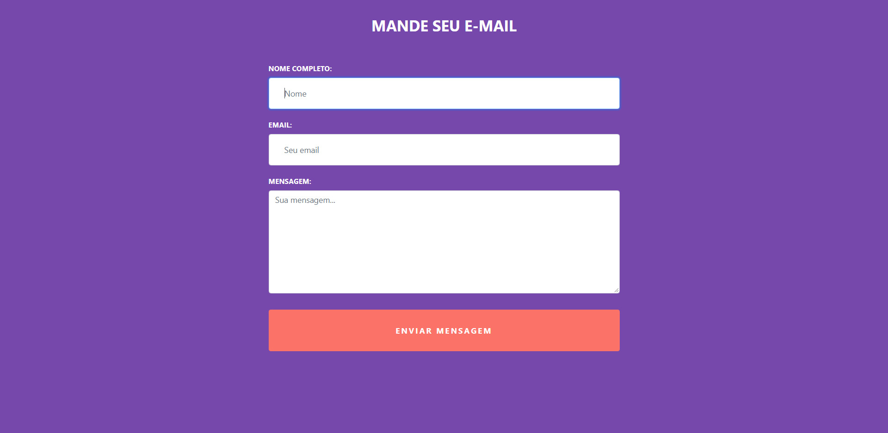

# Enviar E-mail com React JS utilizando EmailJS.

<h1 align="center">
    
</h1>

## 🚀 Tecnologias

Esse projeto foi desenvolvido com as seguintes tecnologias:

- [React.js](https://reactjs.org)
- [JavaScript](https://www.javascript.com/)
- [EmailJS](https://www.emailjs.com/)

## 💻 Projeto

O Mande Seu Email é uma aplicação simples para desenvolvedores front-end que não tem muito conhecimento para criar o back-end com Node.js. 💜

## :memo: Licença

Esse projeto está sob a licença MIT. Veja o arquivo [LICENSE](LICENSE.md) para mais detalhes.
